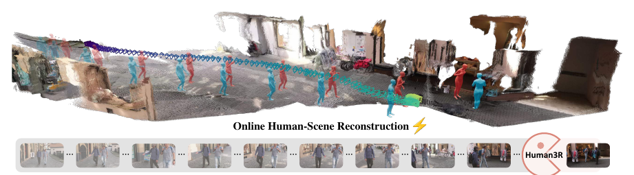
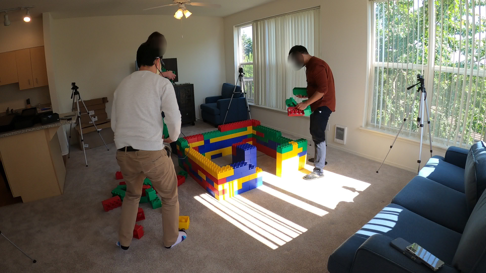
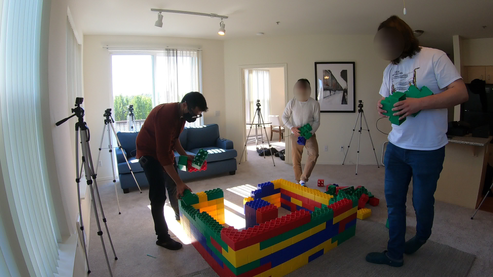
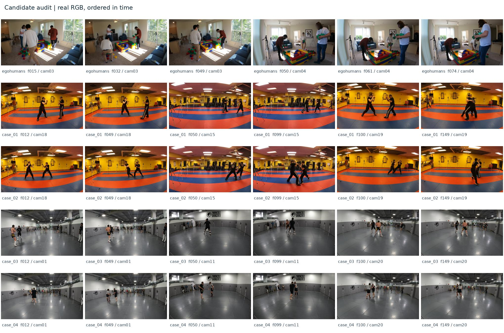
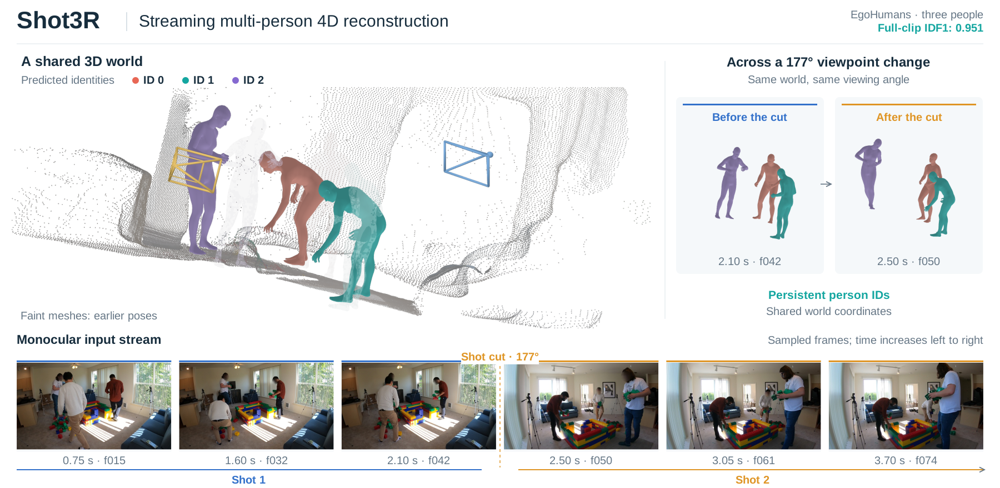
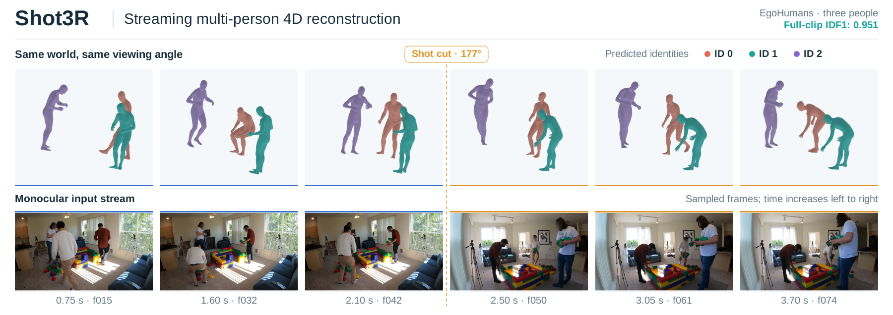

# Shot3R teaser 绘图交接说明

## 1. 给接手绘图 AI 的任务

请为 Shot3R 重新设计一张论文 teaser。**用户不满意已有图稿的观感，不要照抄已有排版；旧图只是内容和素材参考。** 本次工作是交接整理，没有新增绘图或图片生成。

最终方向已经确定：**三镜头、三个人、统一三维空间，表现流式时间推进和两次明显切镜。** 可以采用生成式重绘，不要求逐帧对应当前实验，但最终定位为“概念示意图”，不把生成画面称为真实模型输出。

期望拿到的成品：

- 一张完整、精致、适合论文首页的高清 PNG。
- 一份可编辑排版文件，优先 PPTX，也可以 SVG。生成的主视觉可以是位图，但文字、图例、时间线和切镜标记应独立可编辑。
- 最好另附无文字主视觉，便于后续统一改字。

## 2. 方法是什么，图要表达什么

方法名：**Shot3R**。

英文题目：Shot3R: Streaming Multi-Person 4D Reconstruction from Multi-Shot Videos by Decoupling Alignment and Recurrent State Propagation

中文题目：Shot3R：基于对齐与递归状态传播解耦的多镜头视频流式多人体四维重建。

输入本质是**按时间先后组成的单目视频流**，其中有镜头切换。不是同一时刻的多相机联合输入，也不是同步多视角重建。需要表达的核心关系是：

1. 镜头变化很大，相机位置与观察方向明显变化。
2. 同三个人继续存在，固定颜色对应同一人物身份。
3. 不同镜头下的人体仍在一个统一三维世界中表示。
4. 系统随输入流逐步更新；时间从左向右推进。

方法细节适合放在后续 pipeline 图，不必塞进 teaser。此处不用写损失、模块缩写、三阶段工程流程或公式。

## 3. 推荐构图，但可以重新发挥

### 上方：一个连续的三维世界

采用斜上方视角展示一整个连贯室内空间，而不是三间不相干的房间。场景作为背景，人体是视觉主角。恰好三个不同身份，建议沿用珊瑚橙、青绿、淡紫；每个身份可以出现少量浅色历史姿态，强调时间推进。

三个镜头的相机视锥在同一世界中处于明显不同位置。每个镜头内可以有一小段相机序列，两处切镜体现明显的观察方向变化。不要把它画成静态多相机同步采集装置。

### 下方：三段单目输入时间带

镜头 1 → 切镜 → 镜头 2 → 切镜 → 镜头 3。每段可用两三张小帧图表现时间先后，三段观察方向不同，人物与场景内容保持关联。若这些小图也是生成的，应作为输入示意，不冒充本包数据集的真实帧。

### 观感目标

- 要有一个清楚的视觉主体，有空间感，人物足够大。
- 有吸引力，但仍是简洁的计算机视觉论文插图，不是游戏宣传海报。
- 场景可以干净地重绘，不必复制真实点云的所有噪声。
- 用光照、材质、留白和层次提升观感，避免堆满小字、说明卡片和密集线框。
- 用户希望比当前图更好看，不要求完全复制 Human3R；学习其视觉组织即可。

## 4. 风格参考：Human3R Figure 1

参考的重点是“连续世界全景 + 人物历史姿态 + 相机轨迹 + 下方输入时间带”，不复制其方法名称、数据和文字。



原论文首页也在同目录，裁切边界与来源见 `07_素材溯源与检查/参考图来源.json`。

## 5. 可用的真实素材

### EgoHumans：三人室内交互

当前最适合作为人物、室内结构和配色参考的样例。原始帧包含一次约 177° 的切镜；**三镜头概念图不受这个实际镜头数限制**。





对应透明人体渲染和场景图在 `03_重建效果参考/EgoHumans/`。透明 PNG 可以直接拖进 PPT 或绘图工具，颜色表示该真实结果的预测 ID。

### Harmony4D：三镜头与大角度变化参考

两组真实三镜头序列在 `02_原始视频帧/Harmony4D_case01/` 与 `Harmony4D_case02/`，各包含 9 张关键帧。它们可供观察大视角变化和人物运动，但当前结果不适合作为“身份完全稳定”的实验展示，不必将其动作或人物数量照搬进概念图。



连续 60 帧的 RGB—重建对照视频位于 `02_原始视频帧/EgoHumans/连续RGB与重建参考.mp4`。其播放帧率是素材播放速度，不代表推理性能。

## 6. 已有图稿：用于理解内容，不作为目标风格

用户已经明确表示“现在的图有点丑”。以下是此前生成的排版与真实渲染拼图，不是新的生成式主视觉。





绘图改进建议：弱化表格和对比卡片的感觉，减少碎点云和空白信息区，强化统一场景、人物动态与相机切换之间的视觉联系。这些是交接时的设计建议，不代表用户逐条指定的唯一方案。

旧图中的数据集名、177°、IDF1 等数值只属于那个真实样例。**新概念图不沿用这些数值标签。** 另存的三镜头诊断稿也不应当直接用作最终图。

## 7. 文件夹怎么用

| 目录 | 内容 | 给绘图 AI 的用途 |
| --- | --- | --- |
| `01_风格参考/` | Human3R Figure 1 裁切、原论文首页 | 构图与风格参考 |
| `02_原始视频帧/` | EgoHumans 和两组 Harmony4D 原帧、候选总览、连续视频 | 室内结构、人物、镜头变化参考 |
| `03_重建效果参考/` | 透明人体 PNG、场景渲染 PNG、重建接触图 | 人体网格形态、配色与空间内容参考 |
| `04_已有图稿_仅供内容参考/` | 所有旧版 PNG / SVG / PDF | 了解之前表达了哪些内容，不要直接仿照 |
| `05_可编辑文件/` | 两份真实结果 PPT、三镜头占位模板、模板 SVG / PNG / PDF | 需要时提取图层或复用文字 |
| `06_提示词与图注/` | 详细中英文生成提示词、精简任务提示词、中英文概念图注 | 直接复制给生图工具 |
| `07_素材溯源与检查/` | 素材出处、帧号、历史校验、复制清单 | 核对素材，不必全部上传绘图工具 |

**最快用法：**先把本说明、Human3R 裁切参考图、两张 EgoHumans 原帧，以及 `06_提示词与图注/生成提示词_三镜头三人_中英文.md` 交给对方。需要额外细节时再补上传透明人体图和旧稿。这样比一次塞入所有图片更容易明确主次。

PPT 和 SVG 都是独立可打开的文件。旧真实结果 PPT 中，文字和箭头可编辑，人物与场景是可独立移动、替换的图片，不是可以直接编辑每个网格顶点的矢量模型。三镜头 PPT 是占位排版模板，不是成品主视觉。

## 8. 可以直接复制的简短任务

```text
请为 Shot3R 重新画一张高级、简洁、吸引人的计算机视觉论文 teaser 概念图。
核心是三个按时间先后组成的单目镜头、三个固定身份的人物、一个统一三维世界。
上方用一个连贯的三维室内全景，三个固定颜色的人体和少量浅色历史姿态表现时间推进，
相机经过两次明显换位；下方是一条分为三段的输入时间带。
参考 Human3R Figure 1 的视觉组织，但不要复制它，也不要照抄所附旧稿的排版。
可以自由生成更好看的场景和人体示意，不必逐帧复刻实验。
这是一张概念示意，不要生成实验指标、数据集名称或声称是真实预测。
请先生成无文字主视觉，后续用可编辑文字和箭头排版；最终提供高清 PNG 和可编辑 PPT/SVG。
```

对应英文版本和更完整的约束在 `06_提示词与图注/`。

## 9. 图注建议

英文：**Conceptual illustration of Shot3R.** A monocular stream passes through three shots while the same three people are represented in a shared 3D world. Consistent colors indicate identities, and faded poses illustrate temporal progression.

中文：**Shot3R 的概念示意。** 单目输入流依次经过三个镜头，同三个人在统一三维世界中表示。固定颜色指示人物身份，浅色姿态示意时间推进。

## 10. 交接边界

本文件夹只整理素材和已有图稿，没有重新绘图、调用生图 API 或修改论文与实验结果。不包含模型权重、代码环境或大体积预测缓存。原素材仍保留在原目录。

图片来源于研究数据和论文参考。上传第三方工具前请遵守相应数据集与论文素材的使用要求，保留已有的人脸匿名化。本包不提供人物姓名或个人身份信息。
