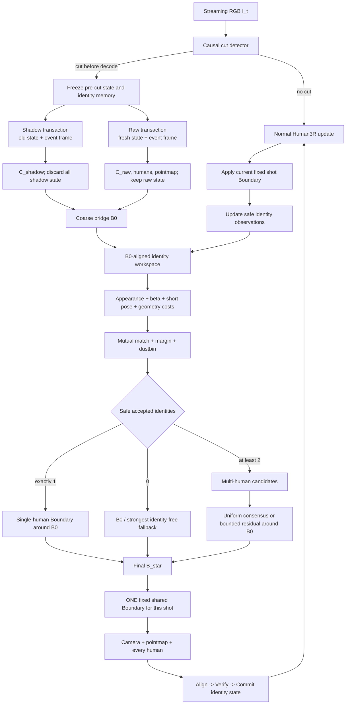
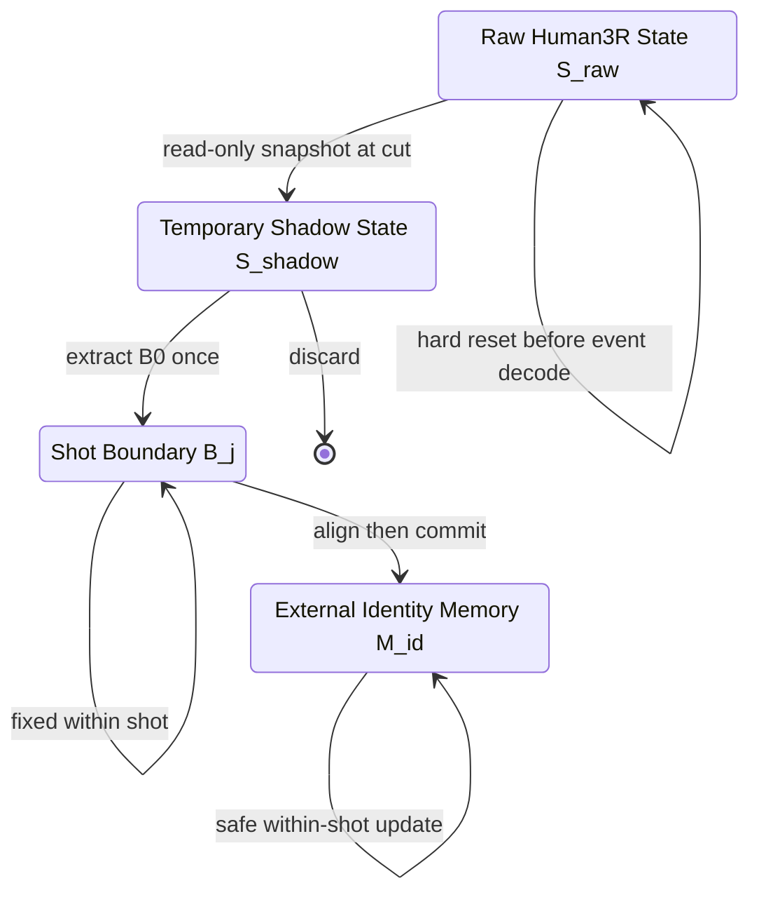

# Movie3R V14：完整方法设计、实现状态与外部评审说明

日期：2026-07-29

用途：这是一份可独立阅读的方法规格，用于制作流程图，并交给外部研究者评价
Movie3R V14 的创新性、方法完整性、技术正确性和 ICLR 投稿成熟度。

本文不是实验日志，也不是把未来计划包装成现有结果。每个模块都使用以下状态标签：

| 标签 | 含义 |
|---|---|
| **[已实现]** | 已有代码路径，可以实际推理或训练 |
| **[探针实现]** | 已在受控脚本中运行，但接口、数据覆盖或部署条件尚不完整 |
| **[部分实现]** | 只有一部分能力已接入，完整协议尚未闭环 |
| **[计划]** | 方法设计已明确，但当前没有可声称完成的实现或结果 |
| **[可选研究]** | 只有在核心方法不足时才启用，不应默认写入论文主方法 |
| **[排除]** | 当前版本明确不采用 |

如果本文与早期 V14 设计稿在实现状态上冲突，以本文和
`V14_CAUSAL_AUTOID_MULTIHUMAN_STATUS_20260729.md` 为准。

---

## 1. 一页概括

### 1.1 要解决的问题

Human3R 可以在一个连续镜头内流式重建 camera、pointmap 和多个人体，但 camera cut
会同时产生两个不同问题：

1. **旧状态污染**：旧镜头 recurrent state 不应继续写入新镜头；
2. **世界坐标断裂**：即使 hard reset，新镜头也只得到一个干净但独立的局部坐标系。

只做 reset 会解决第一个问题，却不会把新镜头接回旧世界。只延续旧 state 可能保住
坐标关系，却会污染后续整段轨迹。Movie3R V14 的核心设计是把二者严格拆开：

```text
一条可提交的 raw-reset Human3R trajectory
+
一次不可提交的 V9-style shadow correction
+
一个显式、固定、全对象共享的 shot Boundary
```

### 1.2 当前已经跑通的主链路

```text
pre-cut Human3R native tracks
-> 外部给定 camera-cut event
-> 第一张 post-cut frame 运行一次 V14.1 shadow correction
-> 同一张 post-cut frame 运行 fresh Human3R Hard Reset raw branch
-> B0 = C_shadow @ inverse(C_raw)
-> 用 B0 消除 camera gauge 后做匿名 root+torso Hungarian ID matching
-> 每个匹配人物独立产生 Fixed Explicit + V16 Boundary candidate
-> rotation 做等权 SO(3) mean，translation 做算术平均
-> 得到 ONE shared Boundary
-> 固定应用到整个 post-cut segment
```

### 1.3 当前最重要的结构结论

```text
V14 learned B0 回答：新 shot 大致在旧世界的哪里？
身份模块回答：cut 前后谁是谁？
多人显式几何回答：最终 shared Boundary 应该如何精化？
```

职责边界是：

```text
WHO 不能直接预测最终 SE(3)
WHERE 不能偷偷读取 GT identity
任何人物都不能拥有独立 world transform
camera、scene、所有 humans 必须共享 ONE Boundary
```

### 1.4 还没有完成的关键模块

- 自动 camera-cut detector；
- appearance/beta 驱动的 persistent identity state；
- dustbin、进入、离开、漏检和重新出现；
- precision-first identity acceptance；
- 真实多 cut 流 `A -> B -> C`；
- 以 `B0` 为强先验、不会恶化 translation 的多人 residual refinement；
- 多序列 V14.1 训练和完整 frozen evaluation；
- 正式 runtime latency、memory、coverage 和 catastrophic-rate 报告。

因此，当前结论是“完整思路已有关键可行性证据”，而不是“最终可部署系统已完成”。

---

## 2. 问题定义

输入是严格按时间到达的单目 RGB stream：

\[
I_1, I_2, \ldots, I_t.
\]

视频由多个 shot 组成，cut 时刻记为 \(\tau_j\)。在时刻 \(t\)，系统只能读取：

\[
\{I_k\mid k\leq t\}.
\]

系统输出：

- camera-to-world pose \(C_t\)；
- world pointmap \(P_t\)；
- 每个人的 SMPL-X 参数；
- world root、joints 和 vertices；
- 跨 shot 的 persistent human identity。

目标约束：

```text
causal
online
streaming
fixed-size persistent state
fixed-budget cut processing
no future frames
no global BA
no full-video optimization
no history rewrite
```

### 2.1 State transition 与 Gauge transition

Human3R 的连续更新可抽象为：

\[
S_t = F(S_{t-1}, I_t), \qquad Y_t=H(S_t).
\]

camera cut 后必须先切断旧状态：

\[
S_{\tau_j}^{\text{raw}} = F(S_{\text{fresh}}, I_{\tau_j}).
\]

但 fresh state 的输出位于新 shot-local 坐标 \(L_j\)，仍需一个映射到 persistent world
\(W\) 的 Boundary：

\[
B_j: L_j\rightarrow W.
\]

V14 的研究对象不是重新做完整视频优化，而是在 cut 发生时只估计一次 \(B_j\)，并在
该 shot 内固定使用。

---

## 3. 模块总表

| 编号 | 模块 | 当前状态 | 当前/目标职责 |
|---|---|---|---|
| M0 | RGB 输入与 Human3R 预处理 | **[已实现]** | 与 `demo.py` 一致的 resize/crop/normalize |
| M1 | Causal camera-cut detector | **[计划]** | 在当前帧 decode 前给出 cut event |
| M2 | 原版 Human3R shot-local reconstruction | **[已实现]** | 连续镜头内 camera/scene/human 重建 |
| M3 | Pre-cut context/state snapshot | **[探针实现]** | 为一次 shadow rollout 提供只读旧状态 |
| M4 | V14.1 V9-style correct-token branch | **[已实现]** | 只修第一张 post-cut frame 的 latent |
| M5 | Raw-reset / shadow 双 rollout 事务 | **[探针实现]** | raw state 提交，shadow state 丢弃 |
| M6 | 显式 coarse Boundary `B0` | **[已实现]** | 从 corrected/raw camera 差值提取粗 gauge |
| M7 | Shot-persistent external identity state | **[计划]** | 跨 cut 保存 WHO，独立于 Human3R state |
| M8 | `B0`-assisted cross-shot matcher | **[探针实现]** | 当前为匿名 root+torso Hungarian |
| M9 | Dustbin、生命周期、precision gate | **[计划]** | 处理人数变化并阻止 wrong accept |
| M10 | Top-K joint WHO-WHERE hypotheses | **[可选研究]** | 固定预算消解仍然存在的身份歧义 |
| M11 | Per-human Fixed Explicit + V16 | **[探针实现]** | 每个可靠身份独立产生 `(R_i,t_i)` |
| M12 | Uniform Multi-Human Consensus | **[已实现]**（冻结） | 等权 SO(3) mean + raw translation mean |
| M13 | `B0`-centered bounded refinement | **[计划]** | 避免旧 root-depth translation 覆盖较准 `B0` |
| M14 | Multi/single/identity-free fallback | **[部分实现]** | 根据安全身份数量降级 |
| M15 | ONE shared Boundary application | **[已实现]** | camera、pointmap、所有 humans 共用变换 |
| M16 | Align-Then-Commit state update | **[计划]** | Boundary 确定后才提交 identity/world state |
| M17 | Demo payload 与可视化 | **[已实现]** | 输出 `demo.py` 格式长序列结果 |

---

## 4. 两张总流程图

### 4.1 当前真实可运行链路

```mermaid
flowchart TD
    A[Pre-cut RGB frames] --> B[Original Human3R continuous rollout]
    B --> C[Native within-shot tracks]
    D[Externally supplied cut index] --> E{First post-cut frame}
    C --> F[V14.1 shadow rollout\nV9 correct tokens ON]
    E --> F
    E --> G[Fresh Human3R raw rollout\nHard Reset, correction OFF]
    F --> H[C_shadow\nDiscard shadow state]
    G --> I[C_raw + local humans + pointmap\nCommit raw-reset state]
    H --> J[B0 = C_shadow inv(C_raw)]
    I --> J
    C --> K[Pre-cut root and torso]
    J --> L[Map post geometry by B0]
    I --> L
    K --> M[Anonymous root+torso cost]
    L --> M
    M --> N[Hungarian one-to-one assignment\nSame visible set only]
    N --> O[Per-human Fixed Explicit + V16]
    O --> P[Equal SO3 mean + equal translation mean]
    P --> Q[ONE fixed shared Boundary]
    Q --> R[Transform all post-cut cameras and pointmaps\nHumans share the same world gauge]
```

图中没有 appearance、dustbin 或 automatic detector，因为它们当前尚未接入。

### 4.2 目标完整系统



---

## 5. 坐标系、符号与变换约定

本文使用 camera-to-world 约定：

| 符号 | 含义 |
|---|---|
| \(L_j\) | 第 `j` 个 shot 的 Human3R local world gauge |
| \(W\) | 跨 shot persistent world gauge |
| \(C_t^{L_j}\) | raw Human3R 输出的 camera-to-local-world pose |
| \(B_j\) | 从 \(L_j\) 到 \(W\) 的 4x4 Boundary |
| \(C_t^W\) | 对齐后的 camera-to-persistent-world pose |
| \(p_t^{L_j}\) | local world 中的 point/root/joint/vertex |
| \(p_t^W\) | persistent world 中的对应点 |

统一左乘：

\[
C_t^W = B_j C_t^{L_j},
\]

\[
\tilde p_t^W = B_j\tilde p_t^{L_j}.
\]

这里 \(\tilde p\) 是齐次坐标。不能对 camera、scene 和不同人物使用不同的
Boundary。

多 cut 情况下，如果 shadow 输出仍位于上一 shot 的 local gauge：

\[
\Delta B_{0,j}=C_{\tau_j}^{L_{j-1},\text{shadow}}
\left(C_{\tau_j}^{L_j,\text{raw}}\right)^{-1},
\]

\[
B_{0,j}=B_{j-1}\Delta B_{0,j}.
\]

当前单 cut runner 将 pre-cut gauge 直接作为展示 world，因此实现中写成：

\[
B_0=C_{\text{shadow}}C_{\text{raw}}^{-1}.
\]

这两个写法不矛盾；后者等价于令上一段 Boundary 为单位阵或已经吸收到
`C_shadow` 中。

---

## 6. 状态所有权与事务语义

### 6.1 长期允许存在的状态



最终系统长期只保留：

1. 一条 raw-reset Human3R recurrent state；
2. 当前 shot 的一个固定 Boundary；
3. 固定大小 external identity state。

### 6.2 Shadow state 为什么必须丢弃

Shadow branch 的目的是利用旧状态和 correct-token attention 猜出一次粗 bridge，
不是产生第二条长期轨迹。如果提交 shadow state，会重新引入旧 shot contamination，
同时难以和未来 V13 hard reset 语义兼容。

### 6.3 Cut 时的原子顺序

```text
1. detector 标记当前帧为 cut event
2. 冻结上一 shot 的 raw state 和 identity memory
3. shadow branch 从旧状态读取，但禁止 commit
4. raw branch 在当前帧 decode 前 fresh reset
5. 计算 B0
6. tentative identity association
7. 估计并验证最终 Boundary
8. 只提交 raw branch state、Boundary 和 accepted identity observations
9. 释放 shadow state
```

任何 post-cut identity/world observation 都不能在第 7 步之前污染长期 memory。

---

## 7. M0-M1：输入与 Causal Camera-Cut Detector

### 7.1 M0 RGB 输入与预处理 **[已实现]**

系统直接接收完整 RGB 画面，不使用逐人物 GT crop。当前 Human3R/V14 推理遵循
`demo.py` 的 long-edge resize、center crop、归一化和 `PatchEmbedDust3R` 路径。
V14.1 早期实验曾因训练使用 `resize_only_16`、demo 使用 Human3R preprocessing 而产生
明显 contract mismatch；该结果已撤回，当前修正路径要求 train/demo RGB tensor 一致。

可部署的人体 bbox、mask、human token 和 detection score 必须来自 Human3R 输出。GT
bbox、GT keypoint、GT identity、GT camera、GT SMPL/SMPL-X 不得进入部署 candidate
generation。

### 7.2 M1 当前事实 **[计划]**

当前训练和推理使用外部 `shot_label` 或 `--cut_indices`，自动 detector 未实现。
因此所有现有结果都属于“cut 时刻已知”的受控协议。

### 7.3 必须满足的接口

\[
(e_t,q_t)=D_{\text{cut}}(I_{t-1},I_t),
\]

其中：

- \(e_t\in\{0,1\}\) 是 cut event；
- \(q_t\in[0,1]\) 是置信度；
- 只能读取当前帧和历史；
- 必须在当前帧 recurrent decoder 写 state 前完成判断。

当前帧可以先经过无状态 image encoder，再用 pooled frozen image tokens 判断 cut；这仍然
满足 pre-decode reset，因为 encoder 本身没有写 recurrent state。

### 7.4 推荐的最小实现

第一版 detector 不应成为主要研究变量。建议比较并冻结：

```text
Baseline A: RGB histogram/content-change detector
Baseline B: cosine distance of frozen Human3R/DINO pooled image features
Final simple detector: calibrated combination + threshold + one-frame refractory rule
```

可使用的因果特征：

- 相邻帧冻结 image embedding cosine distance；
- HSV histogram distance；
- edge-change ratio；
- 可选 encoder token change statistics。

输出只触发状态机，不能预测 Boundary。

### 7.5 必须单独评价

- cut precision、recall、F1；
- detection latency；
- false trigger 后 no-cut parity；
- missed cut 的污染率；
- gradual transition、motion blur、闪光、快速转镜误报；
- detector error 对最终 camera/human catastrophic rate 的影响。

如果 detector 使用 GT cut 评测，必须明确标记为 oracle trigger，不能称作完整部署结果。

---

## 8. M2：原版 Human3R Raw Branch **[已实现]**

输入当前 RGB 和 shot-local recurrent state，输出：

```text
image/scene tokens F_t
pose token z_t
human tokens H_t
new recurrent state S_t
camera pose C_t^local
pointmap/depth/confidence
SMPL-X parameters and smpl_transl
native within-shot smpl_id
```

普通帧完全沿用原 Human3R。V14 不要求正常帧持续运行额外 correct token 或
Boundary solver。

cut 后 raw branch 的关键约束：

```text
fresh state must be created before event-frame decode
all correction tokens OFF
V9 pose/human residual OFF
event-only head LoRA OFF
raw branch is the only committed Human3R trajectory
```

当前 hard-reset 路由已在 `src/dust3r/model.py` 和 V14 runners 中使用。

---

## 9. M3-M4：V14.1 One-Shot Shadow Correction

### 9.1 初始化来源 **[已实现]**

当前活动 checkpoint 的真实来源是：

```text
Original Human3R
-> formal V9 mixed AvatarReX + THuman training
-> V14.1 event-only fine-tuning on one AvatarReX lbn1_1192 event
```

当前活动文件：

```text
/dev/shm/movie3r_v14_1/
v14_1_v9_event_only_boundary_geometry_self20_fp32_e80/checkpoint-best.pth
```

它位于易失内存，属于诊断 checkpoint，不是正式发布权重。其跨数据效果不能解释为
“只用一个样本从零学会了跨视角几何”；它继承了 Human3R 表示和正式 V9 训练先验。

### 9.2 Correct-token 构造 **[已实现]**

当前活动路径保留 V9-parity relation prompt：

\[
A_{\text{corr},t}=
[a_{\text{sem},t};a_{\text{align},t};a_{\text{mom},t}].
\]

Semantic token 聚合当前视觉/人体/pose 与历史 memory：

\[
\gamma_{\text{sem}}=
\sigma(\operatorname{MLP}([a_{\text{cur}},a_{\text{mem}}])),
\]

\[
a_{\text{sem}}=
\gamma_{\text{sem}}a_{\text{cur}}+(1-\gamma_{\text{sem}})a_{\text{mem}}.
\]

Alignment token 表达当前 pose latent 相对历史的变化：

\[
a_{\text{align}}=
\operatorname{MLP}([z_t,z_{t-1},z_t-z_{t-1},a_{\text{mem}}]).
\]

Momentum token 使用上一时刻 correction 状态：

\[
a_{\text{mom}}=
\operatorname{MLP}([A_{\text{corr},t-1},\Delta z_{t-1},g_{t-1}]).
\]

三种 token 加 type embedding 和 LayerNorm 后进入 decoder。仓库还保留一个
`no_momentum` 两-token 简化诊断版本，但它不是当前活动 checkpoint 的结构。

### 9.3 Decoder interaction **[已实现]**

token 顺序：

\[
X_t=[z_t;A_{\text{corr},t};F_t;H_t].
\]

correct tokens 进入完整 recurrent decoder attention，而不是 decoder 后面的浅层 SE(3)
回归器。这样 pose、scene、human 和旧状态可以联合 refine，同时保持第 0 个 token 仍是
Human3R pose token。

### 9.4 Camera corrected head **[已实现]**

refined correct tokens 输出 pose latent residual 和 gate：

\[
\Delta z_t^{\text{raw}}=
\operatorname{MLP}(\operatorname{Mean}(\widetilde A_{\text{corr},t})),
\]

\[
g_t=\sigma(\operatorname{MLP}(\operatorname{Mean}(\widetilde A_{\text{corr},t}))),
\]

\[
\widehat z_t=\widetilde z_t+g_t\Delta z_t^{\text{raw}}.
\]

最后仍由 Human3R pose head 解码 camera：

\[
C_t^{\text{shadow}}=\operatorname{PoseHead}_{\text{LoRA}}(\widehat z_t).
\]

该分支不直接输出 4x4 SE(3)。

### 9.5 Human corrected head **[已实现]**

\[
\Delta H_t^{\text{raw}}=
\operatorname{HumanCorrHead}(
\widetilde H_t,
\operatorname{Mean}(\widetilde A_{\text{corr},t}),
\widehat z_t),
\]

当前主线共享 pose gate：

\[
\widehat H_t=\widetilde H_t+g_t\Delta H_t^{\text{raw}}.
\]

再由带 LoRA 的原 Human3R human head 输出 SMPL-X、shape、pose、expression 和
`smpl_transl`。该分支也不直接预测最终 Boundary。

### 9.6 Event-only routing **[已实现]**

```text
context/normal frame:
    no correct tokens
    no latent correction
    event-only head LoRA off

first post-cut event frame:
    V9 relation tokens on
    pose/human latent correction on
    pose/human head LoRA on

later post-cut frames:
    raw Human3R only
    no additional shadow correction
```

外部 cut event 决定是否插入 correction branch；内部 learned gate 决定 latent residual
幅度。二者不是同一个 gate。

---

## 10. M5：Raw/Shadow 双 Rollout **[探针实现]**

第一张 post-cut image 同时用于两个逻辑分支：

```text
shadow:
    pre-cut read-only context/state
    correction on
    output only C_shadow and diagnostics
    never commit state/memory/tracks

raw:
    fresh Human3R state
    correction off
    output C_raw, local scene and humans
    commit as the new shot-local trajectory
```

当前实验 runner 通过两次独立 rollout 实现这套语义，并重放固定数量 pre-cut frames。
最终工程实现应共享当前帧无状态 encoder 结果并提供显式 state snapshot API，以减少重复
编码；该优化尚未封装成生产 runtime。

这不是双长期 state。shadow 在读出 `B0` 后立即释放。

---

## 11. M6：显式 Coarse Boundary `B0` **[已实现]**

同一张 post-cut frame 产生：

- corrected shadow camera \(C_{\text{shadow}}\)；
- fresh raw camera \(C_{\text{raw}}\)。

定义：

\[
B_0=C_{\text{shadow}}C_{\text{raw}}^{-1}.
\]

所以严格满足：

\[
C_{\text{shadow}}=B_0C_{\text{raw}}.
\]

`B0` 的职责是 identity-free coarse WHERE：

- 消除大视角 camera gauge jump；
- 把 post-cut roots、torso 和 layout 拉回 pre-cut 可比较空间；
- 为后续身份匹配提供坐标归一化；
- 在没有可靠人物时提供一个可用 fallback 候选。

`B0` 不应承担：

- 输出跨 shot 人物 ID；
- 给不同人物分配独立变换；
- 直接成为 learned fusion weight；
- 读取 GT camera 或 GT identity。

当前实现只使用第一张 post-cut frame，不读取任何 post-cut future frame。

---

## 12. M7：Shot-Persistent Identity State **[计划]**

当前 matcher 只使用 pre-cut 最后一帧 Human3R native tracks。目标系统应增加一个与
scene/camera recurrent state 完全分离的 external identity memory。

每个 track 固定保存：

```text
external identity_id
appearance prototype mean/variance or fixed medoid
SMPL beta/shape mean and variance
last valid root-centered local pose
short pose/torso history
last aligned world root and velocity interval
observation count
crop/detection quality statistics
active/inactive flag
last seen timestamp
TTL
```

状态更新规则：

```text
within shot:
    native tracking high confidence -> update safe observations
    low-quality observation -> current output only, no long-term update

at cut:
    identity memory read-only
    all matches tentative

after Boundary verification:
    Match -> Align -> Verify -> Commit
```

appearance/beta 主要回答 WHO；local pose、torso 和 velocity 只作为短时 compatibility，
不能被描述为长期 identity embedding。

---

## 13. M8：当前 `B0`-Assisted Anonymous Matcher **[探针实现]**

### 13.1 当前输入

cut 前最后一个 active track \(i\)：

```text
root r_i^pre
torso orientation T_i^pre
```

cut 后匿名 detection \(j\)：

```text
root r_j^post
torso orientation T_j^post
```

先用 `B0=[R0,t0]` 映射 post geometry：

\[
\bar r_j=R_0r_j^{\text{post}}+t_0,
\]

\[
\bar T_j=R_0T_j^{\text{post}}.
\]

### 13.2 当前 cost

\[
d_{ij}^{\text{root}}=\|r_i^{\text{pre}}-\bar r_j\|_2,
\]

\[
d_{ij}^{\text{torso}}=
d_{SO(3)}(T_i^{\text{pre}},\bar T_j).
\]

每个 cost matrix 用其有限元素中位数归一化：

\[
C_{ij}=\frac{d_{ij}^{\text{root}}}{\operatorname{median}(D^{\text{root}})}+
\frac{d_{ij}^{\text{torso}}}{\operatorname{median}(D^{\text{torso}})}.
\]

然后使用 Hungarian 求一对一最小 cost assignment。

### 13.3 当前严格边界

当前 matcher：

- 不读取 GT identity；
- 不读取 GT camera；
- GT identity 只用于结果 audit；
- 假设 cut 前后检测到同一组人物；
- 没有 dustbin；
- 没有 appearance/beta；
- 没有 acceptance threshold；
- 会强制完成一对一匹配。

因此当前 41/41、61/61、77/78 结果不能覆盖人数变化 cut。

---

## 14. M9：Precision-First Matching 与 Dustbin **[计划]**

目标 matching cost：

\[
C_{ij}=w_a C_{ij}^{\text{app}}
+w_b C_{ij}^{\beta}
+w_g C_{ij}^{B_0\text{-geom}}
+w_p C_{ij}^{\text{pose-compat}}.
\]

其中权重必须只在 development set 上冻结。推荐使用 track-specific normalization：

\[
C_{ij}^{\text{app}}=
\frac{d(f_j,\mu_i)}{\sqrt{\sigma_i^2+\epsilon}},
\]

而不是跨数据共享一个没有校准的绝对距离。

一个 match 只有同时满足以下条件才接受：

1. mutual nearest；
2. top-1/top-2 margin 足够大；
3. appearance 与 beta 不明显冲突；
4. `B0`-aligned root/torso 不明显异常；
5. short-pose compatibility 不出现不可能跳变；
6. detection-order permutation 不改变结果。

否则送入 dustbin。人数不允许假定守恒。

生命周期：

```text
unmatched old track -> inactive, retain fixed TTL
unmatched post detection -> tentative new identity
missed detection -> no forced assignment
reappearance -> first query inactive tracks
low confidence -> do not contaminate old identity prototype
```

本模块最重要的指标不是平均 IDF1，而是：

```text
accepted-match precision
wrong-accept rate
cut-level all accepted matches correct
multi-activation coverage
risk-coverage curve
```

---

## 15. M10：Top-K Joint WHO-WHERE Search **[可选研究]**

如果 precision-first Hungarian coverage 仍过低，可对 2-3 人场景保留有限 assignment
hypotheses：

```text
K <= 6
support unmatched/dustbin
one Boundary solve per hypothesis
no iterative rematching
no future frame
```

每个 hypothesis \(H_k\) 的分数可由以下组成：

\[
s(H_k)=s_{\text{id}}+s_{\text{pose}}+s_{\text{independent-geom}}
-s_{\text{uncertainty}}.
\]

三人时可用 leave-one-human-out：两人估 Boundary，第三人只验证。两人时可用未参与
torso solve 的 visible joints、pairwise layout 和历史 world-root interval。只有 best 与
second-best margin 足够大才接受。

这一模块当前没有实现，也不应在没有以下证据时写成主贡献：

- GT assignment 通常位于很小 top-K；
- joint score 明显优于单次 Hungarian；
- 固定 K 足够，不需要全局搜索；
- 不使用 GT geometry 才能选对。

---

## 16. M11：Per-Human Fixed Explicit + V16 **[探针实现]**

对每个已匹配 identity \(i\)，冻结的 Phase-2 几何产生一个 Boundary candidate。

### 16.1 历史 root 预测

从 pre-cut root history 估计 robust velocity \(v_i\)，得到 post timestamp 的 anchor：

\[
a_i=r_{i,\text{last}}+(t_{\text{post}}-t_{\text{last}})v_i.
\]

### 16.2 Torso motion 预测

从历史 torso rotation 的相对旋转估计角速度，在 SO(3) 上外推目标 torso
\(T_i^{\text{target}}\)。local pose 只描述短时 motion，不被当作身份本身。

### 16.3 Fixed Explicit initializer

当前用近期 root rotation 的 SO(3) mean 得到 target root frame：

\[
R_i^{\text{init}}=R_i^{\text{target-root}}
(R_i^{\text{post-root}})^\top,
\]

\[
t_i^{\text{init}}=a_i-R_i^{\text{init}}r_i^{\text{post}}.
\]

### 16.4 Local pointmap refinement

使用背景 point cloud 做有限局部 refinement。当前实现为 8 次迭代，距离参数为
`0.60/0.12 m`；该 refinement 是冻结的旧几何组件，不允许根据 identity 版本改变。

### 16.5 V16 torso residual

从 Fixed rotation 出发，根据 post torso 和预测 torso 估计 yaw residual，并统一限制在
20 degree：

\[
R_i=\operatorname{V16YawResidual}
(R_i^{\text{fixed}},T_i^{\text{post}},T_i^{\text{target}},20^\circ).
\]

最终 root-anchor translation：

\[
t_i=a_i-R_ir_i^{\text{post}}.
\]

得到：

\[
B_i=[R_i,t_i].
\]

每个身份只产生一个 candidate。身份模块不预测 \(R_i\)、\(t_i\) 或 fusion weight。

---

## 17. M12：Uniform Multi-Human Consensus **[已实现]**（冻结）

对 \(N\) 个可靠人物：

\[
R_{\text{multi}}=
\operatorname{SO3Mean}(R_1,\ldots,R_N),
\]

\[
t_{\text{multi}}=\frac{1}{N}\sum_{i=1}^{N}t_i,
\]

\[
B_{\text{multi}}=[R_{\text{multi}},t_{\text{multi}}].
\]

这里是 `mean_raw_t`：直接平均每个人已经独立产生的 raw translation candidate。

该规则被冻结的原因：

- strict GT-ID 下明显优于可部署 single-human anchor；
- 人数从 1 到 2 到 3 时总体改善；
- 多人最明显地降低 rotation ambiguity；
- confidence weighting、Huber、layout selector、hard reject 没有稳定超过等权平均；
- residual 大不等于人物错误，硬删除容易损失有效几何约束。

禁止让 appearance confidence 直接成为 SE(3) fusion weight。

---

## 18. M13：`B0`-Centered Bounded Refinement **[计划]**

### 18.1 为什么需要这一模块

当前 operational ladder 的顺序是：

```text
B0 只用于 identity matching
-> frozen Phase-2 multi-human solver 从 raw-reset humans 重新估计完整 B
-> 新 B 无条件覆盖 B0
```

长序列探针显示，最终多人 rotation/layout 有时改善，但 translation 在三个案例中都比
`B0` 更差。原因是旧 root-anchor translation 会继承 Human3R depth bias。

因此最终方法不应默认把较准 `B0` 全部丢掉。

### 18.2 待验证的候选形式

把每个完整 candidate 转为 `B0` 周围的左 residual：

\[
E_i=B_iB_0^{-1}=[\Delta R_i,\Delta t_i].
\]

对 residual 做等权 consensus：

\[
\Delta R=\operatorname{SO3Mean}(\Delta R_1,\ldots,\Delta R_N),
\]

\[
\Delta t=\frac1N\sum_i\Delta t_i,
\]

并施加统一 trust region 后：

\[
B^*=\operatorname{Bound}([\Delta R,\Delta t])B_0.
\]

必须至少比较：

```text
B0 only
B0 rotation + uniform multi translation
bounded rotation residual around B0
bounded translation residual around B0
bounded full residual around B0
current full Phase-2 multi Boundary
```

`Bound` 的 translation 半径和 residual 组合方式当前未冻结。因此该公式是明确的下一步
假设，不是已有方法结果。

保留条件：camera P90/P95 和 catastrophic rate 不增加，同时 human root/layout 改善。

---

## 19. M14：Fallback Hierarchy **[部分实现]**

目标固定三级策略：

```text
N_safe >= 2:
    B_final = safe multi-human consensus / bounded residual around B0

N_safe == 1:
    B_final = single-human Fixed Explicit + V16 around B0

N_safe == 0:
    B_final = B0 or frozen strongest identity-independent Movie3R baseline
```

当前 probe 对同人数样本直接要求至少两个人，因此只完整运行了第一条。单人和 `B0`
分支已有独立实验代码，但尚未形成统一、冻结、覆盖人数变化的 runtime 状态机。

fallback 必须同时报告：

- 被激活样本的性能；
- 各级 coverage；
- 全部 cut 的整体性能；
- 不能只报告容易进入 multi 的子集。

---

## 20. M15：ONE Shared Boundary **[已实现]**

最终 Boundary 一旦选定，在整个新 shot 固定：

```text
camera c2w      <- B_final @ camera_local
world pointmap  <- B_final @ pointmap_local
human world root/joints/vertices use the same transformed camera/world gauge
```

实现中 `apply_boundary_to_prediction()` 显式左乘 camera 和
`pts3d_in_other_view`，并保留 local SMPL-X 参数。人体 world 位置通过同一 camera/world
gauge 计算，而不是为 SMPL-X 另造一个人专属变换。

禁止：

- camera 使用一个 Boundary，pointmap 使用另一个；
- 每个人拥有独立 world SE(3)；
- 第一帧和后续帧反复重新估 Boundary；
- 用 latent residual 直接传播整个 shot。

传播的是显式 4x4 Boundary，不是 shadow latent 或 shadow state。

---

## 21. M16：Align-Then-Commit **[计划]**

cut 后所有 identity association 先是 tentative：

```text
Tentative Match
-> Compute B0 / B_final
-> Align post observation into world
-> Verify identity and geometry
-> Commit
```

commit 前禁止：

- 更新 appearance/beta prototype；
- 覆盖旧 external ID；
- 写 world root/global orientation；
- 删除旧 identity；
- 将 shadow state 写入 raw state。

commit 后才更新：

- active/inactive 状态；
- aligned world root 和 motion interval；
- safe appearance/shape observation；
- torso/local-pose history；
- timestamp 和 TTL。

---

## 22. 正常帧与真实 Multi-Cut Stream

### 22.1 正常帧

```text
I_t
-> detector says no cut
-> ordinary Human3R update in current shot-local state
-> apply fixed B_j
-> output camera/scene/humans
-> update only high-quality within-shot identity observations
```

正常帧不运行 shadow、Hungarian、多人 Boundary solve 或 top-K search。

### 22.2 下一次 cut

上一 shot 的 world Boundary 必须参与组合：

```text
A local -> world uses B_A
B raw local -> A local bridge is DeltaB_AB
B world Boundary = B_A @ DeltaB_AB
C world Boundary = B_B @ DeltaB_BC
```

必须测试：

```text
A -> B -> C
A -> B -> A
3 -> 1 -> 3 people
person disappearance and reappearance
```

当前尚未完成真实 multi-cut identity state evolution，不能每个 cut 用 GT identity
重新初始化后声称 multi-cut 已解决。

---

## 23. 当前训练图

### 23.1 V14.1 输入 **[已实现]**

单事件训练样本：

```text
view 0: camera A, frame t-1, shot_label=0
view 1: camera A, frame t,   shot_label=0
view 2: camera B, frame t,   shot_label=1
```

即 `A(t-1) -> A(t) -> B(t)`，同步 cut 用于隔离 viewpoint jump。没有 AABB/AAAA
模式，也不把 detector 训练混入当前 capacity probe。

### 23.2 可训练与冻结参数 **[已实现]**

冻结：

- Human3R image backbone；
- base recurrent decoder 参数；
- scene head；
- base pose head；
- base human/SMPL-X head；
- Multi-HMR backbone。

训练：

- V9 relation correct-token builder；
- pose latent correction head；
- human latent correction head；
- event-only pose-head LoRA；
- event-only human-head LoRA。

### 23.3 当前损失 **[已实现]**

只有 `shot_label=1` 的 event frame 接受 camera/human GT supervision。

Camera：

\[
\mathcal L_{\text{cam}}=
\lambda_t\operatorname{SmoothL1}(\hat t,t^{gt})
+\lambda_R d_q(\hat q,q^{gt}),
\]

当前 \(\lambda_t=1,\lambda_R=5\)。

Human translation：

\[
\mathcal L_{\text{human-trans}}=
10\cdot\operatorname{SmoothL1}(
\widehat{\text{smpl\_transl}},
\text{smpl\_transl}^{gt}).
\]

Latent regularization：

\[
\mathcal L_{\text{latent}}=10^{-5}\|\Delta z\|^2
+10^{-6}\|\Delta H\|^2.
\]

当前活动 geometry-preservation 版本还使用 event-on 与 no-grad event-off 双路输出：

\[
\mathcal L_{\text{self-pm}}
=20\cdot\operatorname{SmoothL1}(P_{\text{self}}^{on},P_{\text{self}}^{off}),
\]

\[
\mathcal L_{\text{shared-pm}}
=0.1\cdot\operatorname{SmoothL1}
(P_{\text{world}}^{on},B_0P_{\text{world}}^{off}),
\]

\[
\mathcal L_{\text{human-keep}}
=0.1\cdot\operatorname{SmoothL1}
(\text{shape/rotmat/expression}^{on},
\text{shape/rotmat/expression}^{off}).
\]

作用是让 correction 主要解释为一个 shared camera/world transform，避免靠破坏 local
pointmap 或 body parameters 拟合 camera target。

### 23.4 当前训练覆盖的真实边界

当前活动 checkpoint 只在一个 AvatarReX event 上做 V14.1 event-only fine-tuning。
修正后的 10-event pilot 和 broad multi-sequence training 尚未完成。因此：

- 单事件低训练误差是 capacity evidence；
- `dance/box/three` 的好结果是有价值的 cross-dataset probe；
- 但还不能替代正式大规模 train/held-out evaluation。

### 23.5 推荐扩展顺序 **[计划]**

```text
one event sanity
-> corrected ten-sequence pilot
-> broader AvatarReX + THuman + MVHuman training
-> frozen MultiHuman three/dance/box evaluation
-> EgoHumans robustness evaluation
```

数据扩展时不同时改变 shadow architecture、identity matcher 和 Boundary fusion。

---

## 24. 推理算法伪代码

```text
Persistent:
    S_raw        # one Human3R shot-local recurrent state
    B_shot       # one fixed local-to-world Boundary
    M_identity   # fixed-size external identity memory (planned)

for each incoming frame I_t:
    event = CutDetector(I_{t-1}, I_t)  # currently externally supplied

    if not event:
        Y_local, S_raw = Human3R(I_t, S_raw)
        Y_world = ApplySharedBoundary(Y_local, B_shot)
        SafeWithinShotIdentityUpdate(M_identity, Y_world)
        emit Y_world
        continue

    old_state = ReadOnlySnapshot(S_raw)
    old_identity = ReadOnlySnapshot(M_identity)

    Y_shadow = V14Shadow(I_t, old_state)      # correction on, no commit
    Y_raw, S_new = Human3R(I_t, FreshState()) # correction off

    B0 = Camera(Y_shadow) @ inverse(Camera(Y_raw))

    tentative = MatchIdentity(
        old_identity,
        MapPostHumans(Y_raw, B0),
        allow_dustbin=True
    )

    safe_matches = PrecisionGate(tentative)

    if count(safe_matches) >= 2:
        candidates = PerHumanFixedV16(safe_matches, Y_raw)
        B_final = MultiConsensusOrBoundedResidual(B0, candidates)
    elif count(safe_matches) == 1:
        B_final = SingleHumanFallbackAroundB0(B0, safe_matches[0])
    else:
        B_final = IdentityFreeFallback(B0)

    Y_world = ApplySharedBoundary(Y_raw, B_final)
    VerifyThenCommit(M_identity, safe_matches, Y_world)

    S_raw = S_new
    B_shot = B_final
    discard Y_shadow and all shadow state
    emit Y_world
```

当前实现中 `MatchIdentity` 是无 dustbin 的 root+torso Hungarian，
`MultiConsensusOrBoundedResidual` 是从头计算的冻结 uniform multi Boundary。

---

## 25. 因果性、预算与复杂度

### 25.1 因果性

- `B0` 只读取 pre-cut 历史和第一张 post-cut frame；
- post-cut future frames 不参与当前 Boundary；
- 已输出历史不回改；
- GT camera/identity 只用于训练 target 或 evaluation，不进入部署推理。

### 25.2 固定预算

普通帧：

```text
one Human3R forward + one fixed matrix application
```

cut 帧：

```text
one raw Human3R rollout
+ one shadow correction rollout
+ one bounded-size identity assignment
+ at most one Boundary solve
```

如果启用 top-K，固定 `K<=6` 且每个 hypothesis 最多一次 solve，不允许迭代到收敛。

### 25.3 固定内存

- Human3R raw state 固定大小；
- shadow state 只在 cut 内临时存在；
- 每个 identity 保存固定 prototype/variance/history；
- active identities 受部署最大人数和 TTL 限制；
- 不保存完整视频、全局 factor graph 或无限 token bank。

### 25.4 尚缺的正式数据

当前没有完整报告：

- normal-frame FPS；
- cut-time latency；
- peak GPU memory；
- shared encoder 后的实际增量成本；
- persistent identity state 的内存上界。

---

## 26. 当前代码对应关系

| 功能 | 主要位置 | 说明 |
|---|---|---|
| Human3R/V9/V14 routing | `src/dust3r/model.py` | correct token、event routing、hard reset 等集中在现有大文件 |
| V14 shared output transform | `src/dust3r/v14_outputs.py` | `B0` 提取和 Boundary application |
| V14.1 training loss plumbing | `src/dust3r/inference.py` | event-off geometry-preservation path |
| V14.1 criterion | `src/dust3r/losses.py` | camera/human latent relation loss |
| Single-segment B0 probe | `versions/v14/run_v14_2_single_sequence.py` | shadow/raw/fixed-B0 对照 |
| Multi-human segment probe | `versions/v14/run_v14_2_multihuman_sequence.py` | 多人长段传播 |
| B0 identity benchmark | `versions/v14/probe_b0_identity_matching.py` | root/torso cost 与 Hungarian |
| Five-step visual ladder | `versions/v14/run_v14_autoid_visual_ladder.py` | original/reset/B0/direct/B0+multi |
| Frozen Phase-2 geometry | `versions/v13/gt_id_consensus.py` | Fixed Explicit、V16、SO(3) mean |

### 26.1 M17 Demo 与可视化输出 **[已实现]**

V14 runner 会把每个 variant 保存为与 `demo.py` viewer 兼容的 prediction/view payload。
当前 five-step visual ladder 固定比较：

```text
1. original Human3R continuous across cut
2. original Human3R with hard reset
3. V14 learned B0 only
4. direct anonymous-ID + uniform multi-human
5. B0-assisted anonymous-ID + uniform multi-human
```

可视化中的人物显示 ID 由 automatic assignment 重新映射；GT identity 只用于生成
独立 audit，不参与 viewer variant 的 matcher 或 Boundary。长段 probe 使用 4 张 pre-cut
帧和 20 张 post-cut 帧，以检查固定 Boundary 和显示 ID 是否在后续帧保持稳定。

3D viewer 是必要的主观审计，但不能替代 camera、human、identity、coverage 和 failure
统计。正式报告必须同时展示成功、普通和失败案例。

当前代码可用于研究探针，但还不是整洁的最终系统模块。正式整理建议拆出：

```text
v14/cut_detector.py
v14/shadow_transaction.py
v14/boundary.py
v14/identity_state.py
v14/identity_matcher.py
v14/multihuman_solver.py
v14/runtime.py
```

不应继续把所有新逻辑无界加入 `src/dust3r/model.py`。

---

## 27. 当前实验证据

### 27.1 Strict GT-ID 多人几何

历史 Phase-2 已证明：正确 ID 下，等权多人共识明显优于可部署的 highest-confidence
single anchor，并且人数增加时整体改善。它构成“多人 WHERE 值得做”的 Oracle 证据。

### 27.2 `B0` 辅助自动身份

受控条件：cut 前后检测到相同的至少两个人，GT identity 只用于计分。

| Sequence | Eligible cuts | Direct all-correct | `B0` all-correct |
|---|---:|---:|---:|
| `three` | 41 | 46.3% | **100.0%** |
| `dance` | 61 | 65.6% | **100.0%** |
| `box` | 78 | 65.4% | **98.7%** |

唯一受控失败：

```text
box_t0630_c0_c3_k8
direct: 0/2
B0: 0/2
GT-camera-aligned geometry: 0/2
```

说明该例是 motion/local-human reconstruction identity ambiguity，不是 shared camera
gauge 没对齐。

### 27.3 变量可见性尚未解决

以下 candidate cuts 因检测集合变化被排除：

```text
three: 22/63
dance: 29/90
box: 12/90
```

这些不是成功样本，也不是 detector failure；它们等待 dustbin/entry/exit 协议。

### 27.4 24-frame causal visual probes

| Case | Humans | Direct ID | `B0` ID | `B0` camera error | Final multi error |
|---|---:|---:|---:|---:|---:|
| `dance_t0600_c1_c4_k1` | 2 | 0/2 | 2/2 | 0.427 m / 2.24 deg | 0.568 m / 4.93 deg |
| `box_t0470_c1_c4_k8` | 2 | 0/2 | 2/2 | 0.390 m / 2.81 deg | 0.466 m / 5.40 deg |
| `three_t0900_c3_c4_k0` | 3 | 0/3 | 3/3 | 0.113 m / 3.85 deg | 0.408 m / 2.26 deg |

它们证明 B0 -> automatic ID -> uniform multi -> fixed segment 可以因果运行。也证明
当前 final multi translation 不是最终答案：三个 probe 都恶化了 `B0` translation。

---

## 28. 已建立、未建立与明确排除

### 28.1 当前可以声称

1. 第一张 post-cut frame 的 V9-style shadow correction 可以产生有用 coarse `B0`；
2. shadow state 可以丢弃，raw-reset state 可以作为唯一后续 trajectory；
3. `B0` 显著改善大视角下匿名 root+torso identity assignment；
4. 正确 automatic assignment 可以驱动冻结的多人共识；
5. 一个 shared Boundary 可以固定传播到较长 post-cut segment；
6. 当前受控 2-3 人路径保持 causal、one-shot 和 fixed-budget。

### 28.2 当前不能声称

1. 已实现自动 cut detection；
2. 已解决一般跨 shot Re-ID；
3. 已解决人数变化、遮挡和重新出现；
4. 已证明 broadly trained V14.1 泛化；
5. 已证明 final Boundary 全面优于 `B0`；
6. 已完成真实 multi-cut stream；
7. 已达到部署级 catastrophic safety；
8. 已完成 ICLR 级 benchmark 和统计显著性。

### 28.3 当前明确排除

- 每个人独立 world transform；
- token 直接预测 final SE(3)；
- learned fusion selector/weights；
- 只按 residual hard reject 人物；
- DA3、VGGT 和 scale refinement 与本阶段混合；
- future frame access；
- global BA、full-video optimization；
- 无条件把旧 V12/V16 residual 叠加到准确 `B0`；
- 在身份未验证前提交 post-cut memory。

---

## 29. 可能的论文贡献与不可过度声称之处

### 29.1 最有潜力的核心贡献

**贡献 A：Cut as a state-and-gauge transaction**

把 camera cut 明确定义为一次“state reset + gauge bridge”事务，而不是每帧 drift
correction。这一建模使状态纯净性和世界连续性可以分别处理。

**贡献 B：Non-committing latent shadow correction**

复用完整 V9 correct-token decoder interaction，只在第一张 post-cut frame 运行，并将
隐式 correction 投影成显式 `B0`，随后丢弃 shadow state。

**贡献 C：Coarse WHERE before WHO**

先用 identity-free `B0` 消除大 camera gauge，再做匿名跨 shot human association。当前
受控结果对这一顺序提供了强证据。

**贡献 D：Identity-conditioned uniform multi-human geometry**

身份只决定人物对应，最终 WHERE 仍由可解释显式几何产生，并让所有对象共享一个
Boundary。

**贡献 E：Strict causal state ownership**

一条 raw trajectory、一次 shadow transaction、一个 fixed shot Boundary 和
Align-Then-Commit identity memory，形成可审计的因果系统。

### 29.2 单独看不够新颖的组件

- hard reset；
- Hungarian assignment；
- SO(3) mean；
- arithmetic translation mean；
- scene-cut detector；
- LoRA；
- appearance Re-ID embedding。

论文创新不能写成这些标准组件的清单。主张必须集中在它们如何围绕 camera-cut 的
state/gauge 解耦形成新的因果方法，以及该结构是否带来可重复的性能优势。

### 29.3 当前最大的创新性风险

如果最终结果只是：

```text
V9 输出一个 camera transform
-> Hungarian
-> 几何平均
```

评审可能认为是已有组件工程组合。要达到强方法论文标准，需要：

1. 清楚形式化 shadow transaction 与 state ownership；
2. 证明 `B0-before-ID` 不是简单后处理替代，而是解决了可测的 permutation failure；
3. 提供 `B0`、WHO、WHERE 三者职责分离的系统消融；
4. 在完整多人、人数变化和多 cut 流上建立明显、稳定的端到端收益；
5. 证明 fixed-budget causal 方法与离线/未来帧方法相比具有独特问题设定和价值。

---

## 30. ICLR 级必做实验

### 30.1 Baselines

```text
Original Human3R continuous
Human3R Hard Reset only
Formal V9 continuous correction
V14 B0 only
Highest-confidence single human
GT-ID uniform multi-human oracle
Automatic ID direct geometry
Automatic ID after B0
Full selective V14 with fallback
```

如果有合理公开方法，还需加入 online tracking/multi-view human alignment baseline；
不能只和自己的历史版本比较。

### 30.2 核心架构消融

- shadow state commit vs discard；
- first-frame-only vs every-frame correction；
- no correct token vs semantic only vs semantic+alignment vs full V9-parity；
- pose correction only vs human correction only vs both；
- head LoRA on/off；
- raw reset timing：pre-decode vs post-decode；
- implicit output only vs explicit fixed `B0` propagation；
- `B0` before identity vs after identity；
- root only、torso only、root+torso、appearance/beta additions；
- full Phase-2 Boundary vs bounded residual around `B0`；
- single vs 2-person vs 3-person consensus。

### 30.3 Identity 与 lifecycle

- detection-order random permutation；
- same visibility 与 variable visibility 分开；
- entry、exit、miss、reappearance；
- `3 -> 1 -> 3`；
- accepted precision / wrong accept / all-matches-correct；
- risk-coverage curves；
- wrong-person、shuffled、zero-state controls。

### 30.4 数据协议

Development 规则冻结后，至少按 sequence 分开报告：

```text
MultiHuman three
MultiHuman dance
MultiHuman box
EgoHumans 001_legoassemble
```

V14.1 训练还需覆盖 AvatarReX、THuman、MVHuman 的多个 sequence/subject/camera pair，
并保证 held-out capture 或 held-out subject。不能用 `three` 同时做 threshold selection 和
最终唯一结论。

### 30.5 评价指标

Camera：

```text
translation, rotation, composite
mean, median, P90, P95
catastrophic rate
```

Human：

```text
world root, joints, vertices
pairwise relative distance/vector
```

Identity：

```text
assignment accuracy, IDF1, ID switches
accepted precision, wrong accept
cut-level all-matches-correct
multi activation coverage
entry/exit/reappearance
```

Streaming：

```text
normal-frame FPS
cut-time latency
peak memory
number of hypotheses
```

### 30.6 统计要求

- 报告每个 sequence，不只报告合并均值；
- 对 cut-level metric 给 bootstrap confidence interval；
- catastrophic threshold 预先定义；
- development threshold 在 frozen evaluation 前锁定；
- 报告 excluded/invalid cuts 和原因；
- visual cases 同时给成功、普通和失败，不只挑最佳结果。

---

## 31. 必须完成的工程与正确性审计

1. **No-cut parity**：未触发时输出与 frozen Human3R 一致；
2. **Pre-decode reset**：event frame 不得先写旧 state 再 reset；
3. **Shadow non-commit**：开关 shadow 后 raw state/memory 完全一致；
4. **Boundary composition**：验证 camera-to-world 左乘方向；
5. **Shared transform**：camera、pointmap、所有 humans 同一矩阵；
6. **Detection permutation**：数组顺序不改变 identity 或 Boundary；
7. **Wrong-ID rejection**：错误人物不能静默进入 shared consensus；
8. **Zero-match fallback**：无安全身份时仍输出合法结果；
9. **No-future leakage**：截断 future frames 后当前结果完全一致；
10. **Multi-cut composition**：`A->B->C` 不重复或漏乘 Boundary；
11. **Checkpoint provenance**：记录 Human3R -> V9 -> V14.1 初始化链；
12. **Train/demo parity**：RGB preprocess、patch embed、routing 和 FP32/AMP 一致。

---

## 32. 给外部评审者的评分表

请按 1-10 分评分，并给出最主要的支持或反对理由。

| 维度 | 需要判断的问题 | 分数 |
|---|---|---:|
| 问题重要性 | 多分镜流式 camera-human-scene reconstruction 是否值得独立研究？ | /10 |
| 建模清晰度 | state contamination 与 world-gauge discontinuity 的拆分是否合理？ | /10 |
| 核心创新性 | non-committing shadow correction -> explicit `B0` 是否构成新方法？ | /10 |
| 方法必要性 | `B0-before-WHO-before-WHERE` 是否有充分技术动机？ | /10 |
| 技术正确性 | 坐标、状态提交、shared Boundary 和因果约束是否自洽？ | /10 |
| 方法简洁性 | 相比问题收益，模块数量和复杂度是否合理？ | /10 |
| 可复现性 | 当前公式、状态和实现边界是否足够明确？ | /10 |
| 实验证据 | 当前证据是否支持核心 claim，而不只是挑选案例？ | /10 |
| 泛化性 | 是否有跨 sequence、跨数据和人数变化证据？ | /10 |
| ICLR 成熟度 | 完成计划实验后，是否达到 ICLR 方法论文标准？ | /10 |

建议评审者重点回答：

1. 哪一个 claim 最像真正的新贡献？
2. 哪一个模块最像不必要的工程堆叠？
3. 是否应把 top-K WHO-WHERE search 放入主方法，还是保持为可选诊断？
4. `B0`-centered residual 应如何设计才最干净？
5. 哪个 baseline 缺失会直接导致拒稿？
6. 当前最危险的 data leakage 或 evaluation bias 是什么？
7. 如果只能补三组实验，哪三组最能决定论文是否成立？

---

## 33. 当前作者侧的诚实判断

### 33.1 可行性

可行性是中高的。最关键的两个环节已经有实证：

```text
one-shot shadow correction 可以产生可用 B0
B0 可以显著改善 wide-view anonymous identity assignment
```

同时 strict GT-ID 已证明多人 consensus 有实际收益，所以从 B0 到多人 WHERE 的链路并非
纯假设。

### 33.2 当前投稿成熟度

目前还不足以直接作为完整 ICLR 投稿结果。主要缺口不是文档，而是：

- V14.1 训练覆盖仍是单事件微调；
- variable visibility 和 persistent identity 没闭环；
- final multi translation 会恶化较准 `B0`；
- detector 未实现；
- multi-cut 与正式 streaming efficiency 未验证；
- 缺少强外部 baseline 和完整 frozen benchmark。

### 33.3 最小可投稿主线

建议将最终主方法压缩为四个不可替代的部分：

```text
1. Cut-triggered raw reset + non-committing shadow transaction
2. Shadow/raw camera difference -> explicit coarse B0
3. B0-assisted precision-first cross-shot identity
4. Identity-conditioned shared multi-human Boundary with safe fallback
```

automatic detector 可以是必要系统组件，但不必包装成主要创新。top-K joint search 只有在
简单 matcher 无法达到安全 coverage 且实验明确有效时，才进入主方法。

---

## 34. 最终方法一句话

> Movie3R V14 将 camera cut 视为一次因果的状态与坐标系事务：系统提交一条 hard-reset
> 后的 Human3R shot-local trajectory，同时在第一张 post-cut frame 上运行一次不提交的
> V9-style shadow correction，将隐式 refine 投影为显式 coarse gauge `B0`；`B0` 先消除
> 大视角坐标跳变以辅助跨 shot 人物关联，可靠身份再驱动可解释的多人 shared Boundary，
> 并将同一个固定变换应用于整个新 shot 的 camera、scene 和所有人体。

---

## 35. 相关文档

```text
versions/v14/docs/Movie3R-V14.MD
versions/v14/docs/V14_1_ONE_SHOT_SHADOW_CORRECTION_TRAINING.md
versions/v14/docs/V14_1_INITIAL_PILOT_RESULTS_20260727.md
versions/v14/docs/V14_2_SINGLE_SEQUENCE_RESULTS_20260727.md
versions/v14/docs/V14_2_MULTIHUMAN_SINGLE_CASE_20260727.md
versions/v14/docs/V14_B0_IDENTITY_MATCHING_RESULTS_20260728.md
versions/v14/docs/V14_B0_IDENTITY_MATCHING_FROZEN_EVAL_20260728.md
versions/v14/docs/V14_CAUSAL_AUTOID_MULTIHUMAN_STATUS_20260729.md
versions/v9/docs/MODEL_ARCHITECTURE_DETAILS.md
```
